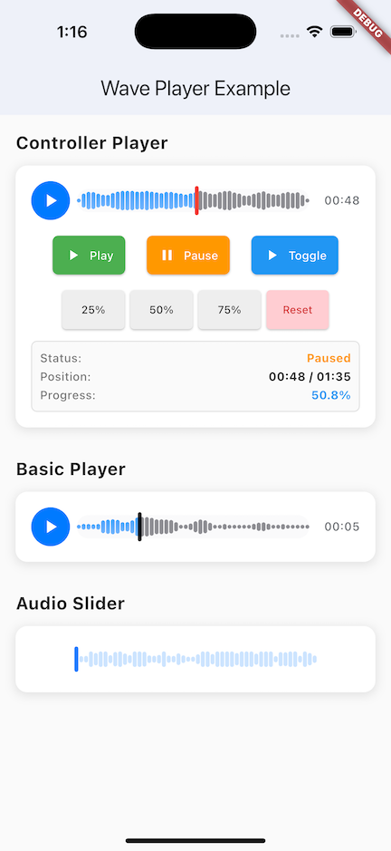
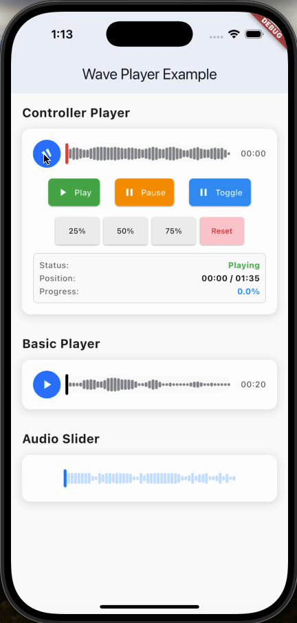
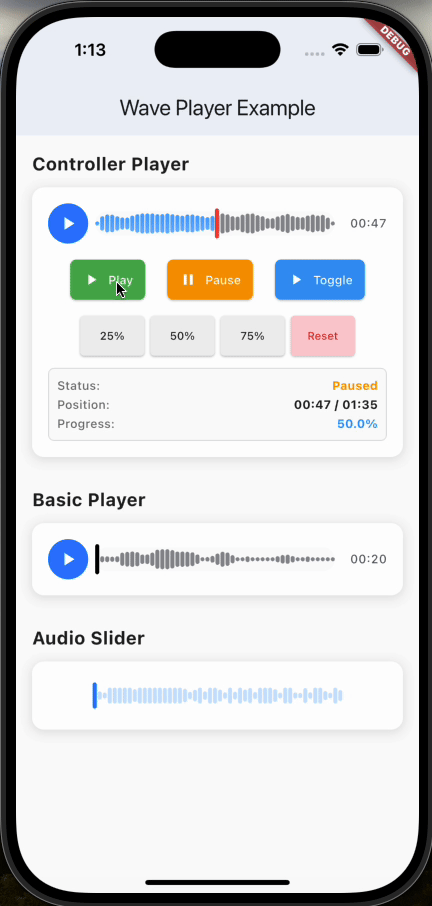

# Wave Player

A Flutter package for audio waveform visualization and playback with customizable UI components.

> 📦 **Package**: [wave_player on pub.dev](https://pub.dev/packages/wave_player)

[](https://pub.dev/packages/wave_player)
<a href="https://pub.dev/packages/wave_player">
  
</a>
<a href="https://flutter.dev/">
  
</a>
<a href="https://opensource.org/licenses/MIT">
  
</a>

### Demo
|Screenshot|Recording 1|Recording 2|
|:---:|:---:|:---:|
||||

## Features

- 🎵 **Waveform Player** — Complete audio player with real-time waveform visualization
- 🎮 **Controller** — Programmatic control via `WaveformPlayerController`
- 🎚️ **Audio Slider** — Standalone waveform slider with multiple thumb shapes
- 🎨 **Theming** — Full color customization and global theme support
- ✨ **Glow Effect** — Animated glow rings on the play/pause button
- 🔄 **Audio Manager** — Singleton for coordinated playback (auto-pause other players)

## Installation

```yaml
dependencies:
  wave_player: ^0.0.4
```

```bash
flutter pub get
```

## Quick Start

### From URL

```dart
import 'package:wave_player/wave_player.dart';

WaveformPlayer(
  audioUrl: 'https://example.com/audio.mp3',
)
```

### From Asset

```dart
WaveformPlayer(
  assetPath: 'assets/audio/sample.mp3',
)
```

### With Controller

```dart
final controller = WaveformPlayerController();

// Widget
WaveformPlayer(
  audioUrl: 'https://example.com/audio.mp3',
  controller: controller,
)

// Programmatic control
await controller.play();
await controller.pause();
await controller.togglePlayPause();
await controller.seekTo(Duration(seconds: 30));
await controller.seekToPercentage(0.5);

// Read state
controller.isPlaying;    // bool
controller.position;     // Duration
controller.duration;     // Duration
controller.isLoading;    // bool
controller.hasError;     // bool
```

## Customization

```dart
WaveformPlayer(
  audioUrl: 'https://example.com/audio.mp3',

  // Waveform
  waveformHeight: 32.0,
  barWidth: 3.0,
  barSpacing: 2.0,
  activeColor: Colors.blue,
  inactiveColor: Colors.grey[300],

  // Thumb
  thumbSize: 20.0,
  thumbShape: ThumbShape.verticalBar, // .circle, .roundedBar
  thumbColor: Colors.blue,

  // Play button
  showPlayButton: true,
  playButtonSize: 48.0,
  playButtonColor: Colors.blue,
  playButtonIconColor: Colors.white,
  // Custom icons:
  playIconWidget: Icon(Icons.play_arrow),
  pauseIconWidget: Icon(Icons.pause),
  // Or animated icon:
  animatedIcon: AnimatedIcons.play_pause,
  iconSize: 24.0,

  // Glow effect
  showGlow: true,
  glowColor: Colors.blue,
  glowCount: 2,
  glowRadiusFactor: 0.25,
  glowDuration: Duration(milliseconds: 1000),

  // Display
  showDuration: true,
  durationTextStyle: TextStyle(fontSize: 12),
  backgroundColor: Colors.white,
  autoPlay: false,

  // Callbacks
  onPlayPause: (isPlaying) => print('Playing: $isPlaying'),
  onPositionChanged: (position) => print('Position: $position'),
  onCompleted: () => print('Done'),
  onError: (error) => print('Error: $error'),
)
```

### Standalone Slider

Use `BasicAudioSlider` for custom player layouts:

```dart
BasicAudioSlider(
  value: currentPosition,
  max: totalDuration,
  onChanged: (value) { /* position changed */ },
  onChangeStart: () { /* seek started */ },
  onChangeEnd: () { /* seek ended */ },
  waveformData: waveformData,
  activeColor: Colors.blue,
  inactiveColor: Colors.grey,
  thumbShape: ThumbShape.verticalBar,
)
```

### Global Theme

```dart
WavePlayerColors.theme = const WavePlayerTheme(
  primaryColor: Color(0xFF2196F3),
  successColor: Color(0xFF4CAF50),
  backgroundColor: Color(0xFFE3F2FD),
  surfaceColor: Color(0xFFFFFFFF),
  textColor: Color(0xFF1565C0),
  textSecondaryColor: Color(0xFF424242),
);
```

## Example

```bash
cd example
flutter run
```

## Requirements

- Flutter 3.6+ / Dart 3.6+
- iOS 11.0+ / Android API 21+

## Dependencies

- [`just_audio`](https://pub.dev/packages/just_audio) — Audio playback
- [`path_provider`](https://pub.dev/packages/path_provider) — File system access
- [`http`](https://pub.dev/packages/http) — HTTP requests

## License

MIT — see [LICENSE](LICENSE).

## Contributing

1. Fork → Create branch → Commit → Push → Pull Request

Issues & questions: [GitHub Issues](https://github.com/QuangNH0606/wave_player/issues)
